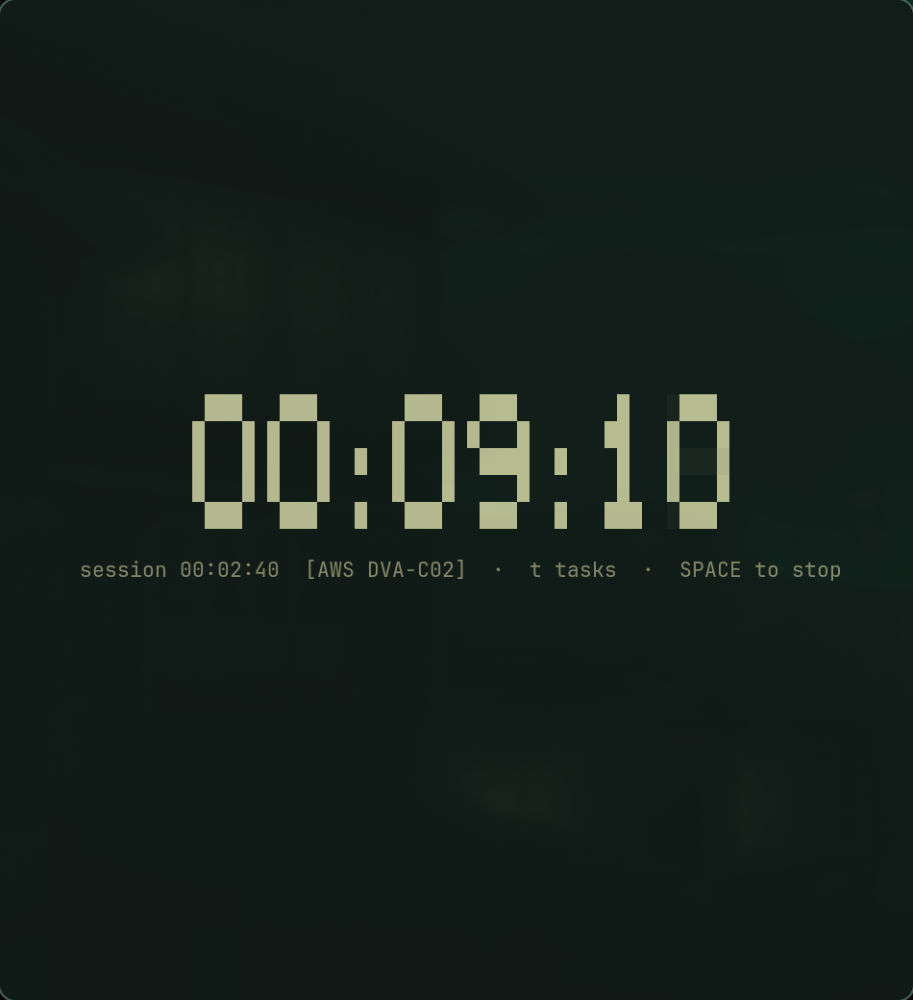

# Horae - Terminal study tracker

A terminal study tracker built with Rust and Ratatui.



## Features

- **Big-digit timer** — session time displayed in block characters, daily total shown below
- **Subjects** — organise sessions by subject; a "General" default is always available
- **Study sessions** — each session is saved to SQLite with start time, end time, and duration
- **Tasks** — lightweight to-do list with title, description, priority, and done/open status
- **Analytics** — weekly bar chart of study hours plus a full history of past sessions

## Keyboard shortcuts

### Timer (idle)

| Key | Action |
|-----|--------|
| `Space` | Open subject selector to start a session |
| `a` | Open analytics |
| `t` | Open tasks |
| `s` | Open subjects |
| `q` | Quit |

### Timer (studying)

| Key | Action |
|-----|--------|
| `Space` | Stop current session |
| `t` | Open tasks |
| `q` | Quit |

### Subject selector

| Key | Action |
|-----|--------|
| `j` / `↓` | Move down |
| `k` / `↑` | Move up |
| `Enter` | Start session with selected subject |
| `Esc` / `q` | Cancel |

### Analytics / Tasks / Subjects

| Key | Action |
|-----|--------|
| `j` / `↓` | Move down |
| `k` / `↑` | Move up |
| `l` / `→` | Expand selected item |
| `h` / `←` / `Esc` | Collapse / go back |
| `n` | New item (tasks and subjects) |
| `d` | Delete selected item |
| `Space` | Toggle task status (tasks only) |
| `q` | Quit |

## Build and run

Requires Rust 1.88 or later.

```sh
cargo run --release
```

The SQLite database (`horae.db`) is created in the current working directory on first run.
